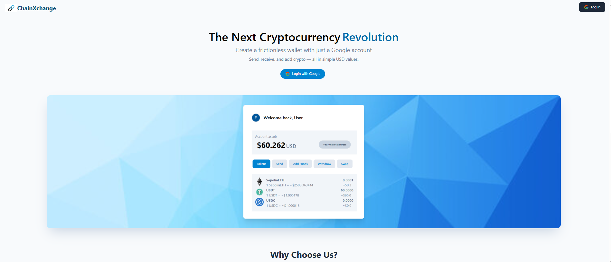

# ChainXchange 

🔗 Live Project - https://chainxchange.vercel.app/

**The Next Cryptocurrency Revolution**

Create your frictionless wallet with just a Google account.  
Send, receive, and add crypto — all in simple USD values.


---




---

## 🚀 Features

- 🔐 **Custodial Wallet with Personal Ownership**  
  Every user has their own wallet (not a shared one). Track all activity transparently on Etherscan.

- 💵 **USD-Based Transactions**  
  Send $5 worth of ETH? Just type "$5" — we handle the rest.

- ⚡ **Instant Swaps**  
  Powered by Uniswap decentralized liquidity for real-time token quotes and swaps.

- 🔗 **MetaMask Integration**  
  Easily connect MetaMask to send, receive, and manage assets.

- 🔐 **Secure Google Login**  
  Fast, safe signup with your Google account.

---

## 🧪 Tech Stack

- **Frontend:** React.js + TypeScript  
- **Backend:** Node.js (Express)  
- **Smart Contracts:** Hardhat, Solidity  
- **DEX & Swaps:** Uniswap Testnet, Uniswap Contracts  
- **Pricing Data:** CoinMarketCap API  
- **Auth:** Auth0 with Google Login  
- **Storage:** MongoDB  
- **Security:** Crypto library (key encryption), Ethers.js (blockchain interaction)

---


## 📦 Installation

 **Clone the repository**
   ```bash
   git clone https://github.com/farman/ChainXchange.git
   cd ChainXchange
   ```

### Frontend

```bash
cd frontend
npm install
npm run dev
```

### Backend

```
cd backend
npm install
npm run dev
```
